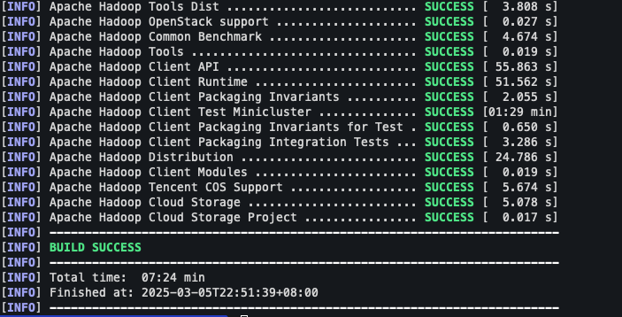
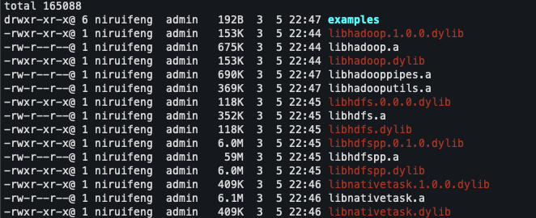

M4-ARM-Hadoop336 : build source code to genenrate native lib

## 1. 下载hadoop336源码，解压

```sh
# 在/opt/software目录下进行编译
cd /opt/software
wget https://archive.apache.org/dist/hadoop/common/hadoop-3.3.6/hadoop-3.3.6-src.tar.gz
tar -zxvf hadoop-3.3.6-src.tar.gz
cd hadoop-3.3.6-src
```

## 2.  下载编译hadoop native 相关依赖

参照hadoop源码中的BUILDINF.txt文件，找到 `Building on macOS` 相关部分

```sh
# Install Xcode Command Line Tools
xcode-select --install

# Install Homebrew
/usr/bin/ruby -e "$(curl -fsSL https://raw.githubusercontent.com/Homebrew/install/master/install)"

# Install OpenJDK 8
brew tap AdoptOpenJDK/openjdk
brew cask install adoptopenjdk8

# Install maven and tools
brew install maven autoconf automake cmake wget

# Mac 电脑自带了openssl 和 protocl ，这一点要注意一下
# Install native libraries, only openssl is required to compile native code,you may optionally install zlib, lz4, etc.
brew install zlib lz4 snappy zstd
# 参考 这个jira，https://issues.apache.org/jira/browse/HADOOP-16647， 显示hadoop 2 supports OpenSSL 1.0.2， Hadoop 3 supports OpenSSL 1.1.0 。所以这里我们需要安装1.1.0版本的openssl
# 现在openssl 1.1.0版本的openssl ，brew已经不支持了，所以需要我们手动源码安装
# 1.1 下载openssl 1.1.0版本源码，声明一下，openssl 1.1.0版本不支持mac arm 编译，需参考如下链接进行编译：https://blog.andrewmadsen.com/2020/06/22/building-openssl-for.html


# Protocol Buffers 3.7.1 (required to compile native code)
wget https://github.com/protocolbuffers/protobuf/releases/download/v3.7.1/protobuf-java-3.7.1.tar.gz
mkdir -p protobuf-3.7 && tar zxvf protobuf-java-3.7.1.tar.gz --strip-components 1 -C protobuf-3.7
cd protobuf-3.7
./configure
make
make check
make install
protoc --version

# 执行编译命令 （绝大概率是会报错的，在hadoop-common编译时）
mvn package -Pdist,native -DskipTests -Dmaven.javadoc.skip \
-Dopenssl.prefix=/opt/openssl
```

## 3. hadoop-common相关报错

#### 3.1 Could NOT find ZLIB (missing: ZLIB_LIBRARY) (found version "1.2.12"), 详细报错信息如下

```verilog
[INFO] Running cmake /opt/software/hadoop-3.3.6-src/hadoop-common-project/hadoop-common/src -DCUSTOM_OPENSSL_PREFIX=/opt/openssl -DGENERATED_JAVAH=/opt/software/hadoop-3.3.6-src/hadoop-common-project/hadoop-common/target/native/javah -DJVM_ARCH_DATA_MODEL=64 -DREQUIRE_BZIP2=false -DREQUIRE_ISAL=false -DREQUIRE_OPENSSL=false -DREQUIRE_ZSTD=false -G Unix Makefiles
[INFO] with extra environment variables {}
[WARNING] CMake Warning (dev) in CMakeLists.txt:
[WARNING]   No project() command is present.  The top-level CMakeLists.txt file must
[WARNING]   contain a literal, direct call to the project() command.  Add a line of
[WARNING]   code such as
[WARNING]
[WARNING]     project(ProjectName)
[WARNING]
[WARNING]   near the top of the file, but after cmake_minimum_required().
[WARNING]
[WARNING]   CMake is pretending there is a "project(Project)" command on the first
[WARNING]   line.
[WARNING] This warning is for project developers.  Use -Wno-dev to suppress it.
[WARNING]
[WARNING] CMake Warning (dev) in CMakeLists.txt:
[WARNING]   cmake_minimum_required() should be called prior to this top-level project()
[WARNING]   call.  Please see the cmake-commands(7) manual for usage documentation of
[WARNING]   both commands.
[WARNING] This warning is for project developers.  Use -Wno-dev to suppress it.
[WARNING]
[WARNING] -- The C compiler identification is AppleClang 16.0.0.16000026
[WARNING] -- The CXX compiler identification is AppleClang 16.0.0.16000026
[WARNING] -- Detecting C compiler ABI info
[WARNING] -- Detecting C compiler ABI info - done
[WARNING] -- Check for working C compiler: /Library/Developer/CommandLineTools/usr/bin/cc - skipped
[WARNING] -- Detecting C compile features
[WARNING] -- Detecting C compile features - done
[WARNING] -- Detecting CXX compiler ABI info
[WARNING] -- Detecting CXX compiler ABI info - done
[WARNING] -- Check for working CXX compiler: /Library/Developer/CommandLineTools/usr/bin/c++ - skipped
[WARNING] -- Detecting CXX compile features
[WARNING] -- Detecting CXX compile features - done
[WARNING] CMake Deprecation Warning at CMakeLists.txt:23 (cmake_minimum_required):
[WARNING]   Compatibility with CMake < 3.10 will be removed from a future version of
[WARNING]   CMake.
[WARNING]
[WARNING]   Update the VERSION argument <min> value.  Or, use the <min>...<max> syntax
[WARNING]   to tell CMake that the project requires at least <min> but has been updated
[WARNING]   to work with policies introduced by <max> or earlier.
[WARNING]
[WARNING]
[WARNING] -- Performing Test CMAKE_HAVE_LIBC_PTHREAD
[WARNING] -- Performing Test CMAKE_HAVE_LIBC_PTHREAD - Success
[WARNING] -- Found Threads: TRUE
[WARNING] -- Found Java: /opt/software/jdk1.8/Contents/Home/bin/java (found version "1.8.0.421")
[WARNING] -- Found JNI: /opt/software/jdk1.8/Contents/Home/include  found components: AWT JVM
[WARNING] CMake Error at /opt/homebrew/share/cmake/Modules/FindPackageHandleStandardArgs.cmake:233 (message):
[WARNING]   Could NOT find ZLIB (missing: ZLIB_LIBRARY) (found version "1.2.12")
[WARNING] Call Stack (most recent call first):
[WARNING]   /opt/homebrew/share/cmake/Modules/FindPackageHandleStandardArgs.cmake:603 (_FPHSA_FAILURE_MESSAGE)
[WARNING]   /opt/homebrew/share/cmake/Modules/FindZLIB.cmake:202 (FIND_PACKAGE_HANDLE_STANDARD_ARGS)
[WARNING]   CMakeLists.txt:47 (find_package)
```

这段日志表明在执行cmake命令时，找不到ZLIB_LIBRARY参数。

这是因为在hadoop-common项目src目录下的CMakeLists.txt文件中显示zlib是必须的，但是我们执行mvn命令时并没有提供这个参数，导致找到的是系统自带的zlib，版本是1.2.12 。不是我们通过brew进行安装的。

解决这个问题，我们需要手动指定zlib的相关路径参数。这里指出一点，传递给cmake的-D参数是有mvn -D参数传递的，具体的参数名在mvn pom文件中能看到，例如hadoop-common项目的pom文件中profile不分，关于相关参数的定义：

```shell
vim hadoop-common-project/hadoop-common/pom.xml
```

```xml
<profile>
      <id>native</id>
      <activation>
        <activeByDefault>false</activeByDefault>
      </activation>
  		<!-- 这是通过mvn -D传递的参数-->
      <properties>
        <require.bzip2>false</require.bzip2>
        <zstd.prefix></zstd.prefix>
        <zstd.lib></zstd.lib>
        <zstd.include></zstd.include>
        <require.zstd>false</require.zstd>
        <openssl.prefix></openssl.prefix>
        <openssl.lib></openssl.lib>
        <openssl.include></openssl.include>
        <require.isal>false</require.isal>
        <isal.prefix></isal.prefix>
        <isal.lib></isal.lib>
        <require.openssl>false</require.openssl>
        <runningWithNative>true</runningWithNative>
        <bundle.openssl.in.bin>false</bundle.openssl.in.bin>
        <extra.libhadoop.rpath></extra.libhadoop.rpath>
      </properties>
      <build>
        <plugins>
          <plugin>
            <groupId>org.apache.maven.plugins</groupId>
            <artifactId>maven-enforcer-plugin</artifactId>
            <executions>
              <execution>
                <id>enforce-os</id>
                <goals>
                  <goal>enforce</goal>
                </goals>
                <configuration>
                  <rules>
                    <requireOS>
                      <family>mac</family>
                      <family>unix</family>
                      <message>native build only supported on Mac or Unix</message>
                    </requireOS>
                  </rules>
                  <fail>true</fail>
                </configuration>
              </execution>
            </executions>
          </plugin>
          <plugin>
            <groupId>org.apache.hadoop</groupId>
            <artifactId>hadoop-maven-plugins</artifactId>
            <executions>
              <execution>
                <id>cmake-compile</id>
                <phase>compile</phase>
                <goals><goal>cmake-compile</goal></goals>
                <configuration>
                  <source>${basedir}/src</source>
                  <!-- 这是maven 解析完传递给cmake的参数-->
                  <vars>
                    <GENERATED_JAVAH>${project.build.directory}/native/javah</GENERATED_JAVAH>
                    <JVM_ARCH_DATA_MODEL>${sun.arch.data.model}</JVM_ARCH_DATA_MODEL>
                    <REQUIRE_BZIP2>${require.bzip2}</REQUIRE_BZIP2>
                    <REQUIRE_ZSTD>${require.zstd}</REQUIRE_ZSTD>
                    <CUSTOM_ZSTD_PREFIX>${zstd.prefix}</CUSTOM_ZSTD_PREFIX>
                    <CUSTOM_ZSTD_LIB>${zstd.lib} </CUSTOM_ZSTD_LIB>
                    <CUSTOM_ZSTD_INCLUDE>${zstd.include} </CUSTOM_ZSTD_INCLUDE>
                    <REQUIRE_ISAL>${require.isal} </REQUIRE_ISAL>
                    <CUSTOM_ISAL_PREFIX>${isal.prefix} </CUSTOM_ISAL_PREFIX>
                    <CUSTOM_ISAL_LIB>${isal.lib} </CUSTOM_ISAL_LIB>
                    <REQUIRE_PMDK>${require.pmdk}</REQUIRE_PMDK>
                    <CUSTOM_PMDK_LIB>${pmdk.lib}</CUSTOM_PMDK_LIB>
                    <REQUIRE_OPENSSL>${require.openssl} </REQUIRE_OPENSSL>
                    <CUSTOM_OPENSSL_PREFIX>${openssl.prefix} </CUSTOM_OPENSSL_PREFIX>
                    <CUSTOM_OPENSSL_LIB>${openssl.lib} </CUSTOM_OPENSSL_LIB>
                    <CUSTOM_OPENSSL_INCLUDE>${openssl.include} </CUSTOM_OPENSSL_INCLUDE>
                    <EXTRA_LIBHADOOP_RPATH>${extra.libhadoop.rpath}</EXTRA_LIBHADOOP_RPATH>
                  </vars>
                </configuration>
              </execution>
              <execution>
                <id>test_bulk_crc32</id>
                <goals><goal>cmake-test</goal></goals>
                <phase>test</phase>
                <configuration>
                  <binary>${project.build.directory}/native/test_bulk_crc32</binary>
                  <timeout>1200</timeout>
                  <results>${project.build.directory}/native-results</results>
                </configuration>
              </execution>
              <execution>
                <id>erasure_code_test</id>
                <goals><goal>cmake-test</goal></goals>
                <phase>test</phase>
                <configuration>
                  <binary>${project.build.directory}/native/erasure_code_test</binary>
                  <timeout>300</timeout>
                  <results>${project.build.directory}/native-results</results>
                  <skipIfMissing>true</skipIfMissing>
                  <env>
                    <LD_LIBRARY_PATH>${LD_LIBRARY_PATH}:${isal.lib}:${isal.prefix}:/usr/lib</LD_LIBRARY_PATH>
                  </env>
                </configuration>
              </execution>
            </executions>
          </plugin>
        </plugins>
      </build>
    </profile>
```

从上面可以看出在hadoop-common项目下并没有解析zlib相关参数

我们可以打开

vim hadoop-3.3.6-src/hadoop-common-project/hadoop-common/target/native/CMakeCache.txt

搜索ZLIB，可以看到cmake 拿到的ZLIB相关参数值，是找的系统自带的zlib路径，且没有找到ZLIB_LIBRART相关

```txt
ZLIB_INCLUDE_DIR:PATH=/Library/Developer/CommandLineTools/SDKs/MacOSX15.2.sdk/usr/include
ZLIB_LIBRARY_DEBUG:FILEPATH=ZLIB_LIBRARY_DEBUG-NOTFOUND
ZLIB_LIBRARY_RELEASE:FILEPATH=ZLIB_LIBRARY_RELEASE-NOTFOUND
//ADVANCED property for variable: ZLIB_INCLUDE_DIR
ZLIB_INCLUDE_DIR-ADVANCED:INTERNAL=1
//ADVANCED property for variable: ZLIB_LIBRARY_DEBUG
ZLIB_LIBRARY_DEBUG-ADVANCED:INTERNAL=1
//ADVANCED property for variable: ZLIB_LIBRARY_RELEASE
ZLIB_LIBRARY_RELEASE-ADVANCED:INTERNAL=1
```

为了解决这个问题，我们需要手动修改hadoop-common项目下的pom文件，增加对ZLIB相关概念参数的解析。

```xml
<!-- 这是通过mvn -D传递的参数-->
<properties>
  <require.bzip2>false</require.bzip2>
  <zstd.prefix></zstd.prefix>
  <zstd.lib></zstd.lib>
  <zstd.include></zstd.include>
  <require.zstd>false</require.zstd>
  <openssl.prefix></openssl.prefix>
  <openssl.lib></openssl.lib>
  <openssl.include></openssl.include>
  <require.isal>false</require.isal>
  <isal.prefix></isal.prefix>
  <isal.lib></isal.lib>
  <require.openssl>false</require.openssl>
  <runningWithNative>true</runningWithNative>
  <bundle.openssl.in.bin>false</bundle.openssl.in.bin>
  <extra.libhadoop.rpath></extra.libhadoop.rpath>
  <!-- 新增zlib相关参数， 通过mvn -D参数来指定-->
  <require.zlib></require.zlib>  <!-- 指定zlib是必须的-->
  <zlib.include.dir></zlib.include.dir> <!-- 指定zlib头文件目录-->
  <zlib.library></zlib.library> <!--指定zlib lib目录-->
</properties>
```

```xml
<!-- 这是maven 解析完传递给cmake的参数-->
<vars>
  <GENERATED_JAVAH>${project.build.directory}/native/javah</GENERATED_JAVAH>
  <JVM_ARCH_DATA_MODEL>${sun.arch.data.model}</JVM_ARCH_DATA_MODEL>
  <REQUIRE_BZIP2>${require.bzip2}</REQUIRE_BZIP2>
  <REQUIRE_ZSTD>${require.zstd}</REQUIRE_ZSTD>
  <CUSTOM_ZSTD_PREFIX>${zstd.prefix}</CUSTOM_ZSTD_PREFIX>
  <CUSTOM_ZSTD_LIB>${zstd.lib} </CUSTOM_ZSTD_LIB>
  <CUSTOM_ZSTD_INCLUDE>${zstd.include} </CUSTOM_ZSTD_INCLUDE>
  <REQUIRE_ISAL>${require.isal} </REQUIRE_ISAL>
  <CUSTOM_ISAL_PREFIX>${isal.prefix} </CUSTOM_ISAL_PREFIX>
  <CUSTOM_ISAL_LIB>${isal.lib} </CUSTOM_ISAL_LIB>
  <REQUIRE_PMDK>${require.pmdk}</REQUIRE_PMDK>
  <CUSTOM_PMDK_LIB>${pmdk.lib}</CUSTOM_PMDK_LIB>
  <REQUIRE_OPENSSL>${require.openssl} </REQUIRE_OPENSSL>
  <CUSTOM_OPENSSL_PREFIX>${openssl.prefix} </CUSTOM_OPENSSL_PREFIX>
  <CUSTOM_OPENSSL_LIB>${openssl.lib} </CUSTOM_OPENSSL_LIB>
  <CUSTOM_OPENSSL_INCLUDE>${openssl.include} </CUSTOM_OPENSSL_INCLUDE>
  <EXTRA_LIBHADOOP_RPATH>${extra.libhadoop.rpath}</EXTRA_LIBHADOOP_RPATH>
  <!-- 新增zlib相关参数， 通过mvn -D参数来指定-->
  <REQUIRE_ZLIB>${require.zlib}</REQUIRE_ZLIB>
  <ZLIB_INCLUDE_DIR>${zlib.include.dir}</ZLIB_INCLUDE_DIR>
  <ZLIB_LIBRARY>${zlib.library}</ZLIB_LIBRARY>
</vars>
```

然后返回hadoop-3.3.6源码目录，继续执行mvn命令

```shell
mvn clean package -e -Pdist,native \
-DskipTests \
-Dmaven.javadoc.skip=true \
-DCMAKE_PREFIX_PATH=/opt/homebrew/opt/cmake \
-Dopenssl.prefix=/opt/openssl \
-Drequire.zlib=true \
-Dzlib.include.dir=/opt/homebrew/opt/zlib/include \
-Dzlib.library=/opt/homebrew/opt/zlib/lib \
-DCMAKE_OSX_ARCHITECTURES=arm64
```

#### 3.2 function-like macro '__GLIBC_PREREQ' is not defined

这个估计是因为mac os 和openssl版本的相关问题，得问问deepseek

这个问题可以在这里找到相关信息：https://issues.apache.org/jira/browse/HADOOP-19170

```
/xxxxx/hadoop/hadoop-common-project/hadoop-common/src/main/native/src/exception.c:114:50: error: function-like macro '__GLIBC_PREREQ' is not defined
#if defined(__sun) || defined(__GLIBC_PREREQ) && __GLIBC_PREREQ(2, 32)
```

现在来修复这个问题， 参考这个**pr**：https://github.com/apache/hadoop/pull/6822/files

### 3.3 dlsym_CRYPTO_num_locks 相关问题

```verilog
WARNING] /opt/software/hadoop-3.3.6-src/hadoop-common-project/hadoop-common/src/main/native/src/org/apache/hadoop/crypto/random/OpensslSecureRandom.c:250:33: error: call to undeclared function 'dlsym_CRYPTO_num_locks'; ISO C99 and later do not support implicit function declarations [-Wimplicit-function-declaration]
[WARNING]   250 |   lock_cs = dlsym_CRYPTO_malloc(dlsym_CRYPTO_num_locks() *  \
[WARNING]       |                                 ^
[WARNING] /opt/software/hadoop-3.3.6-src/hadoop-common-project/hadoop-common/src/main/native/src/org/apache/hadoop/crypto/random/OpensslSecureRandom.c:257:3: error: call to undeclared function 'dlsym_CRYPTO_set_id_callback'; ISO C99 and later do not support implicit function declarations [-Wimplicit-function-declaration]
[WARNING]   257 |   dlsym_CRYPTO_set_id_callback((unsigned long (*)())pthreads_thread_id);
[WARNING]       |   ^
[WARNING] /opt/software/hadoop-3.3.6-src/hadoop-common-project/hadoop-common/src/main/native/src/org/apache/hadoop/crypto/random/OpensslSecureRandom.c:258:3: error: call to undeclared function 'dlsym_CRYPTO_set_locking_callback'; ISO C99 and later do not support implicit function declarations [-Wimplicit-function-declaration]
[WARNING]   258 |   dlsym_CRYPTO_set_locking_callback((void (*)())pthreads_locking_callback);
[WARNING]       |   ^
[WARNING] /opt/software/hadoop-3.3.6-src/hadoop-common-project/hadoop-common/src/main/native/src/org/apache/hadoop/crypto/random/OpensslSecureRandom.c:264:3: error: call to undeclared function 'dlsym_CRYPTO_set_locking_callback'; ISO C99 and later do not support implicit function declarations [-Wimplicit-function-declaration]
[WARNING]   264 |   dlsym_CRYPTO_set_locking_callback(NULL);
[WARNING]       |   ^
[WARNING] /opt/software/hadoop-3.3.6-src/hadoop-common-project/hadoop-common/src/main/native/src/org/apache/hadoop/crypto/random/OpensslSecureRandom.c:266:19: error: call to undeclared function 'dlsym_CRYPTO_num_locks'; ISO C99 and later do not support implicit function declarations [-Wimplicit-function-declaration]
[WARNING]   266 |   for (i = 0; i < dlsym_CRYPTO_num_locks(); i++) {
[WARNING]       |                   ^
[WARNING] 5 errors generated.
[WARNING] make[2]: *** [CMakeFiles/hadoop_static.dir/main/native/src/org/apache/hadoop/crypto/random/OpensslSecureRandom.c.o] Error 1
[WARNING] make[2]: *** Waiting for unfinished jobs....
[WARNING] /opt/software/hadoop-3.3.6-src/hadoop-common-project/hadoop-common/src/main/native/src/org/apache/hadoop/crypto/random/OpensslSecureRandom.c:250:33: error: call to undeclared function 'dlsym_CRYPTO_num_locks'; ISO C99 and later do not support implicit function declarations [-Wimplicit-function-declaration]
[WARNING]   250 |   lock_cs = dlsym_CRYPTO_malloc(dlsym_CRYPTO_num_locks() *  \
[WARNING]       |                                 ^
[WARNING] /opt/software/hadoop-3.3.6-src/hadoop-common-project/hadoop-common/src/main/native/src/org/apache/hadoop/crypto/random/OpensslSecureRandom.c:257:3: error: call to undeclared function 'dlsym_CRYPTO_set_id_callback'; ISO C99 and later do not support implicit function declarations [-Wimplicit-function-declaration]
[WARNING]   257 |   dlsym_CRYPTO_set_id_callback((unsigned long (*)())pthreads_thread_id);
[WARNING]       |   ^
[WARNING] /opt/software/hadoop-3.3.6-src/hadoop-common-project/hadoop-common/src/main/native/src/org/apache/hadoop/crypto/random/OpensslSecureRandom.c:258:3: error: call to undeclared function 'dlsym_CRYPTO_set_locking_callback'; ISO C99 and later do not support implicit function declarations [-Wimplicit-function-declaration]
[WARNING]   258 |   dlsym_CRYPTO_set_locking_callback((void (*)())pthreads_locking_callback);
[WARNING]       |   ^
[WARNING] /opt/software/hadoop-3.3.6-src/hadoop-common-project/hadoop-common/src/main/native/src/org/apache/hadoop/crypto/random/OpensslSecureRandom.c:264:3: error: call to undeclared function 'dlsym_CRYPTO_set_locking_callback'; ISO C99 and later do not support implicit function declarations [-Wimplicit-function-declaration]
[WARNING]   264 |   dlsym_CRYPTO_set_locking_callback(NULL);
[WARNING]       |   ^
[WARNING] /opt/software/hadoop-3.3.6-src/hadoop-common-project/hadoop-common/src/main/native/src/org/apache/hadoop/crypto/random/OpensslSecureRandom.c:266:19: error: call to undeclared function 'dlsym_CRYPTO_num_locks'; ISO C99 and later do not support implicit function declarations [-Wimplicit-function-declaration]
[WARNING]   266 |   for (i = 0; i < dlsym_CRYPTO_num_locks(); i++) {
[WARNING]       |                   ^
[WARNING] 5 errors generated.
[WARNING] make[2]: *** [CMakeFiles/hadoop.dir/main/native/src/org/apache/hadoop/crypto/random/OpensslSecureRandom.c.o] Error 1
[WARNING] make[2]: *** Waiting for unfinished jobs....
[WARNING] make[1]: *** [CMakeFiles/hadoop_static.dir/all] Error 2
[WARNING] make[1]: *** Waiting for unfinished jobs....
[WARNING] make[1]: *** [CMakeFiles/hadoop.dir/all] Error 2
[WARNING] make: *** [all] Error 2
```

我手动编译安装了openssl 1.1.0版本，但是还是出现了这个问题，还得请教一下deepseek

**这个问题主要还是openssl 版本的问题，从hadoop-3.3.6-src/hadoop-common-project/hadoop-common/src/main/native/src/org/apache/hadoop/crypto/random/OpensslSecureRandom.c文件中可以看出来，建议使用openssl版本小于1.1.0版本，是没有这个问题的。**

但是我并不想退回openssl版本了，索性根据deepseek提示对hadoop中的OpensslSecureRandom.c文件源代码进行修改：

```c
// 1. 在文件#include之后，变量定义之前的行添加以下内容
#if OPENSSL_VERSION_NUMBER >= 0x10100000L && !defined(LIBRESSL_VERSION_NUMBER)
#define HADOOP_CRYPTO_set_locking_callback(func)
#define HADOOP_CRYPTO_set_id_callback(func)
#define HADOOP_CRYPTO_num_locks() 1
#endif

// 2. 修改所有调用 CRYPTO_* 的地方为 HADOOP_CRYPTO_*, 例如：
// 示例：替换 dlsym_CRYPTO_num_locks() 调用
for (i = 0; i < HADOOP_CRYPTO_num_locks(); i++) {
  pthread_mutex_destroy(&lock_cs[i]);
}

// 3. 直接注释或删除所有涉及 dlsym_CRYPTO_* 的代码：例如
lock_cs = dlsym_CRYPTO_malloc(HADOOP_CRYPTO_num_locks() * sizeof(pthread_mutex_t));
dlsym_CRYPTO_set_id_callback(...);
dlsym_CRYPTO_set_locking_callback(...);
```

### 3.4 hadoop-yarn-server-nodemanager 编译报错

```verilog
[WARNING] [ 32%] Building C object CMakeFiles/container.dir/main/native/container-executor/impl/modules/devices/devices-module.c.o
[WARNING] /Library/Developer/CommandLineTools/usr/bin/cc  -I/System/Library/Frameworks -I/opt/software/hadoop-3.3.6-src/hadoop-yarn-project/hadoop-yarn/hadoop-yarn-server/hadoop-yarn-server-nodemanager/src -I/opt/software/hadoop-3.3.6-src/hadoop-yarn-project/hadoop-yarn/hadoop-yarn-server/hadoop-yarn-server-nodemanager/target/native -I/opt/software/hadoop-3.3.6-src/hadoop-yarn-project/hadoop-yarn/hadoop-yarn-server/hadoop-yarn-server-nodemanager/src/main/native/container-executor -I/opt/software/hadoop-3.3.6-src/hadoop-yarn-project/hadoop-yarn/hadoop-yarn-server/hadoop-yarn-server-nodemanager/src/main/native/container-executor/impl -I/opt/software/hadoop-3.3.6-src/hadoop-yarn-project/hadoop-yarn/hadoop-yarn-server/hadoop-yarn-server-nodemanager/src/main/native/oom-listener/impl -I/opt/software/hadoop-3.3.6-src/hadoop-yarn-project/hadoop-yarn/hadoop-yarn-server/hadoop-yarn-server-nodemanager/src/../../../../../hadoop-common-project/hadoop-common/src/main/native/src/org/apache/hadoop/security -isystem /opt/software/hadoop-3.3.6-src/hadoop-yarn-project/hadoop-yarn/hadoop-yarn-server/hadoop-yarn-server-nodemanager/src/../../../../../hadoop-common-project/hadoop-common/src/main/native/gtest/include -std=gnu99  -g -O2 -Wall -pthread -D_FILE_OFFSET_BITS=64 -std=gnu99 -arch arm64 -isysroot /Library/Developer/CommandLineTools/SDKs/MacOSX15.2.sdk -MD -MT CMakeFiles/container.dir/main/native/container-executor/impl/modules/devices/devices-module.c.o -MF CMakeFiles/container.dir/main/native/container-executor/impl/modules/devices/devices-module.c.o.d -o CMakeFiles/container.dir/main/native/container-executor/impl/modules/devices/devices-module.c.o -c /opt/software/hadoop-3.3.6-src/hadoop-yarn-project/hadoop-yarn/hadoop-yarn-server/hadoop-yarn-server-nodemanager/src/main/native/container-executor/impl/modules/devices/devices-module.c
[WARNING] /Library/Developer/CommandLineTools/usr/bin/cc -std=gnu99  -g -O2 -Wall -pthread -D_FILE_OFFSET_BITS=64 -arch arm64 -isysroot /Library/Developer/CommandLineTools/SDKs/MacOSX15.2.sdk -Wl,-search_paths_first -Wl,-headerpad_max_install_names "CMakeFiles/oom-listener.dir/main/native/oom-listener/impl/oom_listener.c.o" "CMakeFiles/oom-listener.dir/main/native/oom-listener/impl/oom_listener_main.c.o" -o target/usr/local/bin/oom-listener
[WARNING] [ 32%] Built target oom-listener
[WARNING] [ 34%] Linking CXX static library libgtest.a
[WARNING] /opt/homebrew/bin/cmake -P CMakeFiles/gtest.dir/cmake_clean_target.cmake
[WARNING] /opt/homebrew/bin/cmake -E cmake_link_script CMakeFiles/gtest.dir/link.txt --verbose=1
[WARNING] /Library/Developer/CommandLineTools/usr/bin/ar qc libgtest.a "CMakeFiles/gtest.dir/opt/software/hadoop-3.3.6-src/hadoop-common-project/hadoop-common/src/main/native/gtest/gtest-all.cc.o"
[WARNING] /Library/Developer/CommandLineTools/usr/bin/ranlib libgtest.a
[WARNING] [ 34%] Built target gtest
[WARNING] /opt/software/hadoop-3.3.6-src/hadoop-yarn-project/hadoop-yarn/hadoop-yarn-server/hadoop-yarn-server-nodemanager/src/main/native/container-executor/impl/container-executor.c:1717:5: error: call to undeclared function 'ioctl'; ISO C99 and later do not support implicit function declarations [-Wimplicit-function-declaration]
[WARNING]  1717 |     ioctl(0, TIOCSCTTY, 1);
[WARNING]       |     ^
[WARNING] 1 error generated.
[WARNING] make[2]: *** [CMakeFiles/container.dir/main/native/container-executor/impl/container-executor.c.o] Error 1
[WARNING] make[2]: *** Waiting for unfinished jobs....
[WARNING] make[1]: *** [CMakeFiles/container.dir/all] Error 2
[WARNING] make[1]: *** Waiting for unfinished jobs....
[WARNING] make: *** [all] Error 2
```

同样还是hadoop 的某个c文件调用了未声明的函数导致的，继续请教deepseek。

deepseek给的建议是修改container-executor.c文件

```shell
vim hadoop-3.3.6-src/hadoop-yarn-project/hadoop-yarn/hadoop-yarn-server/hadoop-yarn-server-nodemanager/src/main/native/container-executor/impl/container-executor.c

# 在文件开头的 #include 区域添加：
#include <sys/ioctl.h>  // 添加此行
```

这个问题解决，编译到53%时，遇到了新的问题，继续看

```verilog
[WARNING] [ 53%] Built target gtest
[WARNING] /opt/software/hadoop-3.3.6-src/hadoop-yarn-project/hadoop-yarn/hadoop-yarn-server/hadoop-yarn-server-nodemanager/src/main/native/container-executor/impl/container-executor.c:91:20: warning: unused variable 'PROC_PATH' [-Wunused-variable]
[WARNING]    91 | static const char* PROC_PATH = "/proc";
[WARNING]       |                    ^~~~~~~~~
[WARNING] /opt/software/hadoop-3.3.6-src/hadoop-yarn-project/hadoop-yarn/hadoop-yarn-server/hadoop-yarn-server-nodemanager/src/main/native/container-executor/impl/utils/docker-util.c:58:13: warning: comparison of array 'args->data' equal to a null pointer is always false [-Wtautological-pointer-compare]
[WARNING]    58 |   if (args->data == NULL || args->length >= DOCKER_ARG_MAX) {
[WARNING]       |       ~~~~~~^~~~    ~~~~
[WARNING] /opt/software/hadoop-3.3.6-src/hadoop-yarn-project/hadoop-yarn/hadoop-yarn-server/hadoop-yarn-server-nodemanager/src/main/native/container-executor/impl/utils/docker-util.c:65:13: warning: comparison of array 'args->data' not equal to a null pointer is always true [-Wtautological-pointer-compare]
[WARNING]    65 |   if (args->data != NULL) {
[WARNING]       |       ~~~~~~^~~~    ~~~~
[WARNING] /opt/software/hadoop-3.3.6-src/hadoop-yarn-project/hadoop-yarn/hadoop-yarn-server/hadoop-yarn-server-nodemanager/src/main/native/container-executor/impl/runc/runc.c:18:10: fatal error: 'linux/loop.h' file not found
[WARNING]    18 | #include <linux/loop.h>
[WARNING]       |          ^~~~~~~~~~~~~~
[WARNING] 1 error generated.
[WARNING] make[2]: *** [CMakeFiles/container.dir/main/native/container-executor/impl/runc/runc.c.o] Error 1
[WARNING] make[2]: *** Waiting for unfinished jobs....
[WARNING] /opt/software/hadoop-3.3.6-src/hadoop-yarn-project/hadoop-yarn/hadoop-yarn-server/hadoop-yarn-server-nodemanager/src/main/native/container-executor/impl/runc/runc_reap.c:24:10: fatal error: 'mntent.h' file not found
[WARNING]    24 | #include <mntent.h>
[WARNING]       |          ^~~~~~~~~~
[WARNING] 1 error generated.
[WARNING] make[2]: *** [CMakeFiles/container.dir/main/native/container-executor/impl/runc/runc_reap.c.o] Error 1
[WARNING] /opt/software/hadoop-3.3.6-src/hadoop-common-project/hadoop-common/src/main/native/src/org/apache/hadoop/security/hadoop_user_info.c:195:26: warning: passing 'gid_t *' (aka 'unsigned int *') to parameter of type 'int *' converts between pointers to integer types with different sign [-Wpointer-sign]
[WARNING]   195 |                          uinfo->gids, &ngroups);
[WARNING]       |                          ^~~~~~~~~~~
[WARNING] /Library/Developer/CommandLineTools/SDKs/MacOSX15.2.sdk/usr/include/unistd.h:654:43: note: passing argument to parameter here
[WARNING]   654 | int      getgrouplist(const char *, int, int *, int *);
[WARNING]       |                                               ^
[WARNING] /opt/software/hadoop-3.3.6-src/hadoop-common-project/hadoop-common/src/main/native/src/org/apache/hadoop/security/hadoop_user_info.c:226:26: warning: passing 'gid_t *' (aka 'unsigned int *') to parameter of type 'int *' converts between pointers to integer types with different sign [-Wpointer-sign]
[WARNING]   226 |                          uinfo->gids, &ngroups);
[WARNING]       |                          ^~~~~~~~~~~
[WARNING] /Library/Developer/CommandLineTools/SDKs/MacOSX15.2.sdk/usr/include/unistd.h:654:43: note: passing argument to parameter here
[WARNING]   654 | int      getgrouplist(const char *, int, int *, int *);
[WARNING]       |                                               ^
[WARNING] 2 warnings generated.
[WARNING] 1 warning generated.
[WARNING] 2 warnings generated.
[WARNING] make[1]: *** [CMakeFiles/container.dir/all] Error 2
[WARNING] make[1]: *** Waiting for unfinished jobs....
[WARNING] make: *** [all] Error 2
```

这个报错看起来是nodemanager 容器相关的东西，要去加载linux下的loop.c和mntent.c文件。。mac上没有。。。

尝试了一些办法，没有能够解决这个报错，但是我的目的是获得hadoop native lib，我决定跳过这个project的编译。。。

```
mvn clean package -e -Pdist,native \
-DskipTests \
-Dmaven.javadoc.skip=true \
-pl '!hadoop-yarn-project/hadoop-yarn/hadoop-yarn-server/hadoop-yarn-server-nodemanager' \
-DCMAKE_PREFIX_PATH=/opt/homebrew/opt/cmake \
-Dopenssl.prefix=/opt/openssl \
-Drequire.zlib=true \
-Dzlib.include.dir=/opt/homebrew/opt/zlib/include \
-Dzlib.library=/opt/homebrew/opt/zlib/lib \
-DCMAKE_OSX_ARCHITECTURES=arm64
```

### 3.5  编译 Hadoop YARN Application Catalog Webapp 时报错

```verilog
INFO] Running 'yarn ' in /opt/software/hadoop-3.3.6-src/hadoop-yarn-project/hadoop-yarn/hadoop-yarn-applications/hadoop-yarn-applications-catalog/hadoop-yarn-applications-catalog-webapp/target
[INFO] yarn install v1.22.5
[INFO] info No lockfile found.
[INFO] [1/4] Resolving packages...
[INFO] warning jquery@3.3.1: This version is deprecated. Please upgrade to the latest version or find support at https://www.herodevs.com/support/jquery-nes.
[INFO] warning angular-route@1.6.10: For the actively supported Angular, see https://www.npmjs.com/package/@angular/core. AngularJS support has officially ended. For extended AngularJS support options, see https://goo.gle/angularjs-path-forward.
[INFO] warning angular@1.6.10: For the actively supported Angular, see https://www.npmjs.com/package/@angular/core. AngularJS support has officially ended. For extended AngularJS support options, see https://goo.gle/angularjs-path-forward.
[INFO] warning apidoc > apidoc-core > glob@7.2.3: Glob versions prior to v9 are no longer supported
[INFO] warning apidoc > apidoc-core > glob > inflight@1.0.6: This module is not supported, and leaks memory. Do not use it. Check out lru-cache if you want a good and tested way to coalesce async requests by a key value, which is much more comprehensive and powerful.
[INFO] [2/4] Fetching packages...
[INFO] error triple-beam@1.4.1: The engine "node" is incompatible with this module. Expected version ">= 14.0.0". Got "12.22.1"
[INFO] error Found incompatible module.
[INFO] info Visit https://yarnpkg.com/en/docs/cli/install for documentation about this command
```

这个报错显示Node.js版本太低

使用nvm手动安装Node.js 14

```shell
# 安装 nvm
curl -o- https://raw.githubusercontent.com/nvm-sh/nvm/v0.39.7/install.sh | bash
# 安装并切换至 Node.js 14+  （Node.js 14 需要python3.10以下的版本，可恶我的Mac自带python3.13）
# 使用anaconda 创建一个合适的python环境，在这个环境中进行安装Node.js 14
nvm install 14  # 安装 Node.js 14.x
nvm use 14      # 切换到 Node.js 14
# 验证版本
node -v  # 应输出 v14.x 或更高
# 安装失败， 可恶，后面再折腾吧，先跳过这个模块了
```

重新编译。

```
mvn clean package -e -Pdist,native \
-DskipTests \
-Dmaven.javadoc.skip=true \
-pl '!hadoop-yarn-project/hadoop-yarn/hadoop-yarn-server/hadoop-yarn-server-nodemanager,!hadoop-yarn-project/hadoop-yarn/hadoop-yarn-applications/hadoop-yarn-applications-catalog/hadoop-yarn-applications-catalog-webapp' \
-DCMAKE_PREFIX_PATH=/opt/homebrew/opt/cmake \
-Dopenssl.prefix=/opt/openssl \
-Drequire.zlib=true \
-Dzlib.include.dir=/opt/homebrew/opt/zlib/include \
-Dzlib.library=/opt/homebrew/opt/zlib/lib \
-DCMAKE_OSX_ARCHITECTURES=arm64
```

### 3.6 编译hadoop-mapreduce-client-nativetask 时显示"PRIu64" 空格问题

这个模块不能跳过了，只能老老实实解决问题。

```verilog
[WARNING] /opt/software/hadoop-3.3.6-src/hadoop-mapreduce-project/hadoop-mapreduce-client/hadoop-mapreduce-client-nativetask/src/main/native/src/lib/MapOutputCollector.cc:305:41: error: invalid suffix on literal; C++11 requires a space between literal and identifier [-Wreserved-user-defined-literal]
[WARNING]   305 |     LOG("%s-spill: { id: %d, collect: %"PRIu64" ms, "
[WARNING]       |                                         ^
[WARNING]       |
[WARNING] /opt/software/hadoop-3.3.6-src/hadoop-mapreduce-project/hadoop-mapreduce-client/hadoop-mapreduce-client-nativetask/src/main/native/src/lib/MapOutputCollector.cc:306:28: error: invalid suffix on literal; C++11 requires a space between literal and identifier [-Wreserved-user-defined-literal]
[WARNING]   306 |         "in-memory sort: %"PRIu64" ms, in-memory records: %"PRIu64", "
[WARNING]       |                            ^
[WARNING]       |
[WARNING] /opt/software/hadoop-3.3.6-src/hadoop-mapreduce-project/hadoop-mapreduce-client/hadoop-mapreduce-client-nativetask/src/main/native/src/lib/MapOutputCollector.cc:306:61: error: invalid suffix on literal; C++11 requires a space between literal and identifier [-Wreserved-user-defined-literal]
[WARNING]   306 |         "in-memory sort: %"PRIu64" ms, in-memory records: %"PRIu64", "
[WARNING]       |                                                             ^
[WARNING]       |
[WARNING] /opt/software/hadoop-3.3.6-src/hadoop-mapreduce-project/hadoop-mapreduce-client/hadoop-mapreduce-client-nativetask/src/main/native/src/lib/MapOutputCollector.cc:307:25: error: invalid suffix on literal; C++11 requires a space between literal and identifier [-Wreserved-user-defined-literal]
[WARNING]   307 |         "merge&spill: %"PRIu64" ms, uncompressed size: %"PRIu64", "
[WARNING]       |                         ^
[WARNING]       |
[WARNING] /opt/software/hadoop-3.3.6-src/hadoop-mapreduce-project/hadoop-mapreduce-client/hadoop-mapreduce-client-nativetask/src/main/native/src/lib/MapOutputCollector.cc:307:58: error: invalid suffix on literal; C++11 requires a space between literal and identifier [-Wreserved-user-defined-literal]
[WARNING]   307 |         "merge&spill: %"PRIu64" ms, uncompressed size: %"PRIu64", "
[WARNING]       |                                                          ^
[WARNING]       |
[WARNING] /opt/software/hadoop-3.3.6-src/hadoop-mapreduce-project/hadoop-mapreduce-client/hadoop-mapreduce-client-nativetask/src/main/native/src/lib/MapOutputCollector.cc:308:23: error: invalid suffix on literal; C++11 requires a space between literal and identifier [-Wreserved-user-defined-literal]
[WARNING]   308 |         "real size: %"PRIu64" path: %s }",
[WARNING]       |                       ^
[WARNING]       |
[WARNING] /opt/software/hadoop-3.3.6-src/hadoop-mapreduce-project/hadoop-mapreduce-client/hadoop-mapreduce-client-nativetask/src/main/native/src/lib/MapOutputCollector.cc:373:55: error: invalid suffix on literal; C++11 requires a space between literal and identifier [-Wreserved-user-defined-literal]
[WARNING]   373 |   LOG("Final-merge-spill: { id: %d, in-memory sort: %"PRIu64" ms, "
[WARNING]       |                                                       ^
[WARNING]       |
[WARNING] /opt/software/hadoop-3.3.6-src/hadoop-mapreduce-project/hadoop-mapreduce-client/hadoop-mapreduce-client-nativetask/src/main/native/src/lib/MapOutputCollector.cc:374:29: error: invalid suffix on literal; C++11 requires a space between literal and identifier [-Wreserved-user-defined-literal]
[WARNING]   374 |       "in-memory records: %"PRIu64", merge&spill: %"PRIu64" ms, "
[WARNING]       |                             ^
[WARNING]       |
[WARNING] /opt/software/hadoop-3.3.6-src/hadoop-mapreduce-project/hadoop-mapreduce-client/hadoop-mapreduce-client-nativetask/src/main/native/src/lib/MapOutputCollector.cc:374:53: error: invalid suffix on literal; C++11 requires a space between literal and identifier [-Wreserved-user-defined-literal]
[WARNING]   374 |       "in-memory records: %"PRIu64", merge&spill: %"PRIu64" ms, "
[WARNING]       |                                                     ^
[WARNING]       |
[WARNING] /opt/software/hadoop-3.3.6-src/hadoop-mapreduce-project/hadoop-mapreduce-client/hadoop-mapreduce-client-nativetask/src/main/native/src/lib/MapOutputCollector.cc:375:19: error: invalid suffix on literal; C++11 requires a space between literal and identifier [-Wreserved-user-defined-literal]
[WARNING]   375 |       "records: %"PRIu64", uncompressed size: %"PRIu64", "
[WARNING]       |                   ^
[WARNING]       |
[WARNING] /opt/software/hadoop-3.3.6-src/hadoop-mapreduce-project/hadoop-mapreduce-client/hadoop-mapreduce-client-nativetask/src/main/native/src/lib/MapOutputCollector.cc:375:49: error: invalid suffix on literal; C++11 requires a space between literal and identifier [-Wreserved-user-defined-literal]
[WARNING]   375 |       "records: %"PRIu64", uncompressed size: %"PRIu64", "
[WARNING]       |                                                 ^
[WARNING]       |
[WARNING] /opt/software/hadoop-3.3.6-src/hadoop-mapreduce-project/hadoop-mapreduce-client/hadoop-mapreduce-client-nativetask/src/main/native/src/lib/MapOutputCollector.cc:376:21: error: invalid suffix on literal; C++11 requires a space between literal and identifier [-Wreserved-user-defined-literal]
[WARNING]   376 |       "real size: %"PRIu64" path: %s }",
[WARNING]       |                     ^
[WARNING]       |
[WARNING] /opt/software/hadoop-3.3.6-src/hadoop-mapreduce-project/hadoop-mapreduce-client/hadoop-mapreduce-client-nativetask/src/main/native/src/lib/MapOutputCollector.cc:305:41: error: invalid suffix on literal; C++11 requires a space between literal and identifier [-Wreserved-user-defined-literal]
[WARNING]   305 |     LOG("%s-spill: { id: %d, collect: %"PRIu64" ms, "
[WARNING]       |                                         ^
[WARNING]       |
[WARNING] /opt/software/hadoop-3.3.6-src/hadoop-mapreduce-project/hadoop-mapreduce-client/hadoop-mapreduce-client-nativetask/src/main/native/src/lib/MapOutputCollector.cc:306:28: error: invalid suffix on literal; C++11 requires a space between literal and identifier [-Wreserved-user-defined-literal]
[WARNING]   306 |         "in-memory sort: %"PRIu64" ms, in-memory records: %"PRIu64", "
[WARNING]       |                            ^
[WARNING]       |
[WARNING] /opt/software/hadoop-3.3.6-src/hadoop-mapreduce-project/hadoop-mapreduce-client/hadoop-mapreduce-client-nativetask/src/main/native/src/lib/MapOutputCollector.cc:306:61: error: invalid suffix on literal; C++11 requires a space between literal and identifier [-Wreserved-user-defined-literal]
[WARNING]   306 |         "in-memory sort: %"PRIu64" ms, in-memory records: %"PRIu64", "
[WARNING]       |                                                             ^
[WARNING]       |
[WARNING] /opt/software/hadoop-3.3.6-src/hadoop-mapreduce-project/hadoop-mapreduce-client/hadoop-mapreduce-client-nativetask/src/main/native/src/lib/MapOutputCollector.cc:307:25: error: invalid suffix on literal; C++11 requires a space between literal and identifier [-Wreserved-user-defined-literal]
[WARNING]   307 |         "merge&spill: %"PRIu64" ms, uncompressed size: %"PRIu64", "
[WARNING]       |                         ^
[WARNING]       |
[WARNING] /opt/software/hadoop-3.3.6-src/hadoop-mapreduce-project/hadoop-mapreduce-client/hadoop-mapreduce-client-nativetask/src/main/native/src/lib/MapOutputCollector.cc:307:58: error: invalid suffix on literal; C++11 requires a space between literal and identifier [-Wreserved-user-defined-literal]
[WARNING]   307 |         "merge&spill: %"PRIu64" ms, uncompressed size: %"PRIu64", "
[WARNING]       |                                                          ^
[WARNING]       |
[WARNING] /opt/software/hadoop-3.3.6-src/hadoop-mapreduce-project/hadoop-mapreduce-client/hadoop-mapreduce-client-nativetask/src/main/native/src/lib/MapOutputCollector.cc:308:23: error: invalid suffix on literal; C++11 requires a space between literal and identifier [-Wreserved-user-defined-literal]
[WARNING]   308 |         "real size: %"PRIu64" path: %s }",
[WARNING]       |                       ^
[WARNING]       |
[WARNING] 12 errors generated.
[WARNING] /opt/software/hadoop-3.3.6-src/hadoop-mapreduce-project/hadoop-mapreduce-client/hadoop-mapreduce-client-nativetask/src/main/native/src/lib/MapOutputCollector.cc:373:55: error: invalid suffix on literal; C++11 requires a space between literal and identifier [-Wreserved-user-defined-literal]
[WARNING]   373 |   LOG("Final-merge-spill: { id: %d, in-memory sort: %"PRIu64" ms, "
[WARNING]       |                                                       ^
[WARNING]       |
[WARNING] /opt/software/hadoop-3.3.6-src/hadoop-mapreduce-project/hadoop-mapreduce-client/hadoop-mapreduce-client-nativetask/src/main/native/src/lib/MapOutputCollector.cc:374:29: error: invalid suffix on literal; C++11 requires a space between literal and identifier [-Wreserved-user-defined-literal]
[WARNING]   374 |       "in-memory records: %"PRIu64", merge&spill: %"PRIu64" ms, "
[WARNING]       |                             ^
[WARNING]       |
[WARNING] /opt/software/hadoop-3.3.6-src/hadoop-mapreduce-project/hadoop-mapreduce-client/hadoop-mapreduce-client-nativetask/src/main/native/src/lib/MapOutputCollector.cc:374:53: error: invalid suffix on literal; C++11 requires a space between literal and identifier [-Wreserved-user-defined-literal]
[WARNING]   374 |       "in-memory records: %"PRIu64", merge&spill: %"PRIu64" ms, "
[WARNING]       |                                                     ^
[WARNING]       |
[WARNING] /opt/software/hadoop-3.3.6-src/hadoop-mapreduce-project/hadoop-mapreduce-client/hadoop-mapreduce-client-nativetask/src/main/native/src/lib/MapOutputCollector.cc:375:19: error: invalid suffix on literal; C++11 requires a space between literal and identifier [-Wreserved-user-defined-literal]
[WARNING]   375 |       "records: %"PRIu64", uncompressed size: %"PRIu64", "
[WARNING]       |                   ^
[WARNING]       |
[WARNING] /opt/software/hadoop-3.3.6-src/hadoop-mapreduce-project/hadoop-mapreduce-client/hadoop-mapreduce-client-nativetask/src/main/native/src/lib/MapOutputCollector.cc:375:49: error: invalid suffix on literal; C++11 requires a space between literal and identifier [-Wreserved-user-defined-literal]
[WARNING]   375 |       "records: %"PRIu64", uncompressed size: %"PRIu64", "
[WARNING]       |                                                 ^
[WARNING]       |
[WARNING] /opt/software/hadoop-3.3.6-src/hadoop-mapreduce-project/hadoop-mapreduce-client/hadoop-mapreduce-client-nativetask/src/main/native/src/lib/MapOutputCollector.cc:376:21: error: invalid suffix on literal; C++11 requires a space between literal and identifier [-Wreserved-user-defined-literal]
[WARNING]   376 |       "real size: %"PRIu64" path: %s }",
[WARNING]       |                     ^
[WARNING]       |
[WARNING] make[2]: *** [CMakeFiles/nativetask_static.dir/main/native/src/lib/MapOutputCollector.cc.o] Error 1
[WARNING] make[2]: *** Waiting for unfinished jobs....
[WARNING] 12 errors generated.
[WARNING] make[2]: *** [CMakeFiles/nativetask.dir/main/native/src/lib/MapOutputCollector.cc.o] Error 1
[WARNING] make[2]: *** Waiting for unfinished jobs....
[WARNING] make[1]: *** [CMakeFiles/nativetask_static.dir/all] Error 2
[WARNING] make[1]: *** Waiting for unfinished jobs....
[WARNING] /opt/software/hadoop-3.3.6-src/hadoop-mapreduce-project/hadoop-mapreduce-client/hadoop-mapreduce-client-nativetask/src/main/native/src/lib/Merge.cc:133:12: warning: variable 'total_record' set but not used [-Wunused-but-set-variable]
[WARNING]   133 |   uint64_t total_record = 0;
[WARNING]       |            ^
[WARNING] In file included from /opt/software/hadoop-3.3.6-src/hadoop-mapreduce-project/hadoop-mapreduce-client/hadoop-mapreduce-client-nativetask/src/main/native/src/lib/Merge.cc:22:
[WARNING] /opt/software/hadoop-3.3.6-src/hadoop-mapreduce-project/hadoop-mapreduce-client/hadoop-mapreduce-client-nativetask/src/main/native/src/lib/Merge.h:229:12: warning: private field '_config' is not used [-Wunused-private-field]
[WARNING]   229 |   Config * _config;
[WARNING]       |            ^
[WARNING] 2 warnings generated.
[WARNING] make[1]: *** [CMakeFiles/nativetask.dir/all] Error 2
[WARNING] make: *** [all] Error 2
```

编译器提示在使用 `PRIu64` 宏时需要在格式字符串中的 `%` 和宏之间加一个空格。这是由于 C++11 标准要求在字面量和标识符之间要有空格，以避免歧义。

```sh
# 修改 PRId64 和 PRIu64
vim hadoop-3.3.6-src/hadoop-mapreduce-project/hadoop-mapreduce-client/hadoop-mapreduce-client-nativetask/src/main/native/src/util/StringUtil.cc
# 修改 PRIu64
vim hadoop-3.3.6-src/hadoop-mapreduce-project/hadoop-mapreduce-client/hadoop-mapreduce-client-nativetask/src/main/native/src/lib/MapOutputCollector.cc
# 修改 PRId64
vim hadoop-3.3.6-src/hadoop-mapreduce-project/hadoop-mapreduce-client/hadoop-mapreduce-client-nativetask/src/main/native/test/TestCompressions.cc
```

终于编译成功了



生成的lib目录下



最终编译命令

```
mvn clean package -e -Pdist,native \
-DskipTests \
-Dmaven.javadoc.skip=true \
-pl '!hadoop-yarn-project/hadoop-yarn/hadoop-yarn-server/hadoop-yarn-server-nodemanager,!hadoop-yarn-project/hadoop-yarn/hadoop-yarn-applications/hadoop-yarn-applications-catalog/hadoop-yarn-applications-catalog-webapp' \
-DCMAKE_PREFIX_PATH=/opt/homebrew/opt/cmake \
-Dopenssl.prefix=/opt/openssl \
-Drequire.zlib=true \
-Dzlib.include.dir=/opt/homebrew/opt/zlib/include \
-Dzlib.library=/opt/homebrew/opt/zlib/lib \
-Drequire.snappy=true \
-Dsnappy.prefix=/opt/homebrew/opt/snappy \
-Dsnappy.lib=/opt/homebrew/opt/snappy/lib \
-Dsnappy.include=/opt/homebrew/opt/snappy/include \
-Drequire.zstd=true \
-Dzstd.prefix=/opt/homebrew/opt/zstd \
-Dzstd.lib=/opt/homebrew/opt/zstd/lib \
-Dzstd.include=/opt/homebrew/opt/zstd/include \
-DCMAKE_OSX_ARCHITECTURES=arm64
```


